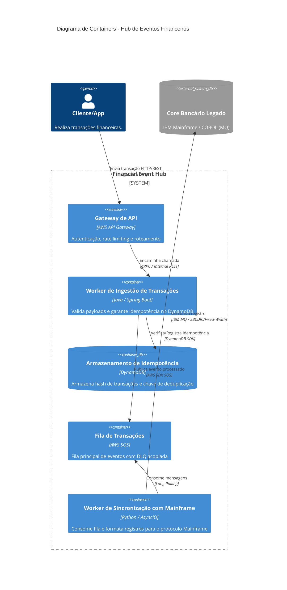
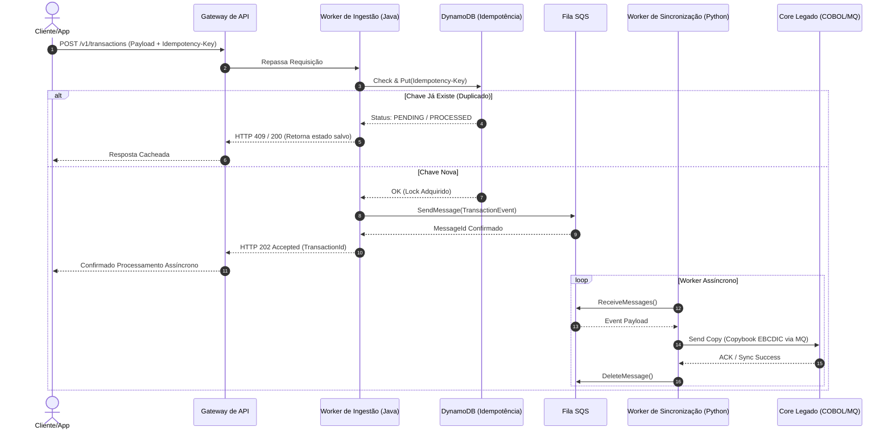

# Hub de Eventos Financeiros - Documentação & Diagramas como Código

## 1. Visão Geral do Sistema
- **Domínio e Escopo:** Plataforma responsável por capturar eventos transacionais da AWS e sincronizar de forma assíncrona com o Core Bancário Legado (Mainframe/COBOL via IBM MQ).
- **Nível da Visão:** C4 Model (Containers) e Diagrama de Sequência.
- **Componentes:** AWS API Gateway, Ingestion Worker (Java/Spring Boot), DynamoDB (Idempotência), AWS SQS, Mainframe Sync Worker (Python) e Core Legado (COBOL/MQ).
- **Restrições:** Baixa latência, garantia *At-Least-Once*, compliance com LGPD/PCI-DSS e idempotência estrita.

## 2. Diagramas em Mermaid.js

### A. Diagrama Estrutural: Visão de Containers (C4 Model - Nível 2)

### B. Diagrama de Sequência

